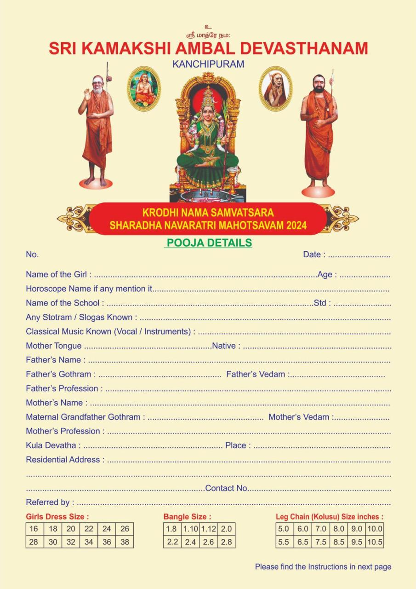
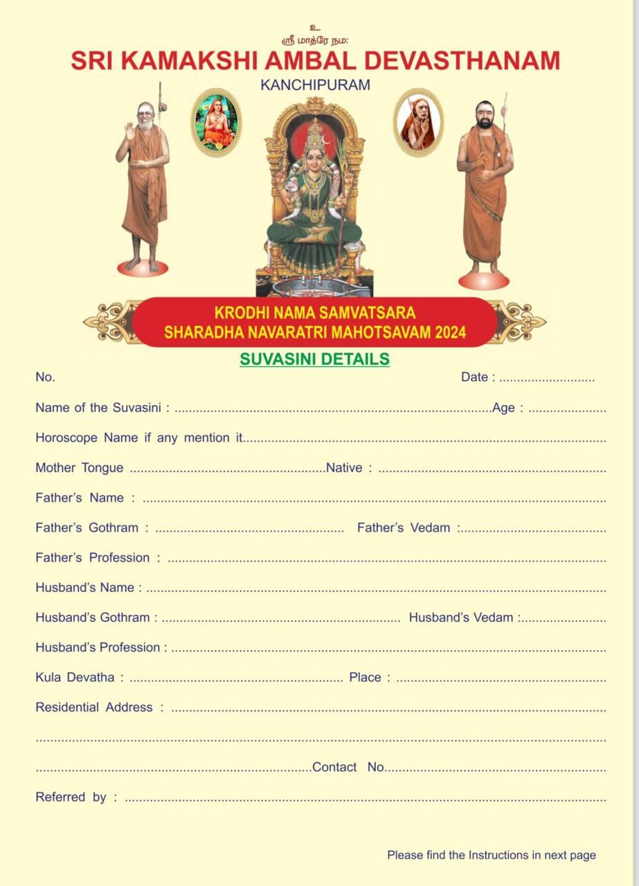

# User Persona

## Who is a User ?
Any Devotee who wishes to Register themselves for the pooja is considered a User.

## Types of Users
There are two types of Users.

| Kanya | Suvashini |
|-------| --------- |
| Aged 0 ~ 13. | Aged xx and above. |
| Has **not** started Menstrual Cycle.|  Has **completed** Menstrual Cycle. |

## Registration

| Kanya | Suvashini |
|-------| --------- |
| Validates Aadhar Number | Validates Aadhar Number |
| Fills this  | Fills this  |
| User is allowed to Select within a Date range | User is allowed to Select within a Date range |
| Users from a Specific Location are allowed on Only specific dates | Users from a Specific Location are allowed on Only specific dates |
| Submits Registration | Submits Registration |

The user is provided with a *Unique Code* on successful submission of the request.

## Post Registration

- Upon receipt of the *Unique Code* on Registration. The user enters a combination of the below to Check the Verification status.
    - Unique Code
    - Phone Number
    - Aadhar Number
- User is displayed with the status 
    - Information provided during the Registration
    - Status (Approved / Rejected)
    - If Approved, a **QR Code** for Entry.
- User prints the information and carries a Hard Copy to the Event Venue.
